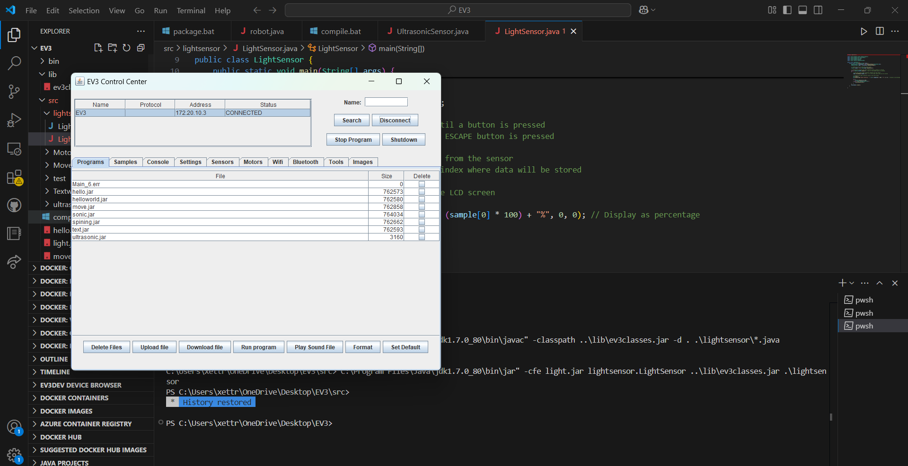

# Group19-EV3# EV3-Group19

## Objective

## --  The aim of our project is to make a LEGO Mindstorms EV3 robot that can follow a black line
# and detect obstacles using its sensors.
## We are implementing the ultrasonic, light sensor, and line following.

## PURAN KAKRI

##   1.  I have connected ev3 too the pc to the ev3 and have tested the hellowold text.

##   2. I have tested the the motorspin as the motor are spinning and workin well

